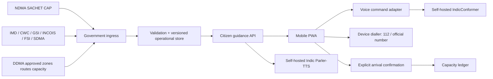
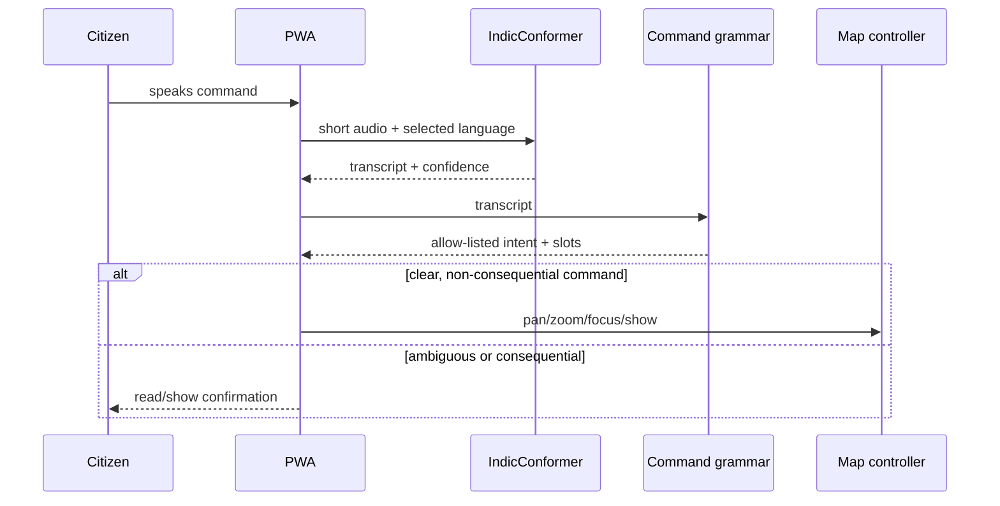

# Architecture

## 1. Boundary

Sthira is a dissemination and interaction layer. Government systems remain the systems of authority for alerts, hazard/red zones, safe zones, routes, instructions, capacities, and emergency response.

## 2. Deployable shape

Start as a modular monolith plus workers:

- TypeScript mobile-first PWA with MapLibre GL and accessible non-map views.
- FastAPI application with PostgreSQL/PostGIS.
- Background workers for CAP polling, government file/API ingestion, validation, cache refresh, notification fan-out, and speech synthesis.
- Object storage for signed source artifacts, approved instruction media, and generated audio cache.
- Redis only if required for short-lived cache, rate limits, and job coordination.
- Self-hosted GPU inference services for IndicConformer and Indic Parler-TTS behind internal APIs.
- Government-controlled hosting in India for production operational data.

No microservice split is required until measured load or independent security ownership demands it.

## 3. Modules

| Module | Responsibility | Must not do |
| --- | --- | --- |
| Source adapters | Fetch CAP, APIs, WMS/WMTS, and governed files | Scrape around access controls or infer authority |
| Validator | Verify schema, signature/checksum where available, geography, times, source, and version | Convert an invalid record into a valid one |
| Alert service | Normalize CAP fields without losing the original | Rewrite official severity or instructions |
| Zone service | Serve active official red/safe-zone versions | Predict zones or safety |
| Assignment service | Apply the approved government allocation policy to eligible safe zones | Allocate to an unapproved/full/closed facility |
| Route service | Return the government-approved route and steps | Compute an unofficial “safer” route in baseline |
| Capacity ledger | Reserve/confirm/release places with idempotency and audit | Treat a map view as arrival |
| Voice service | ASR, deterministic intent parsing, TTS | Use a generative model to authorize action |
| Citizen API | Compose the emergency experience | Hide data age or source |
| Operator console | Import/publish authorized operational packages and corrections | Create statutory authority |
| Audit | Preserve source-to-screen and capacity-event history | Store unnecessary raw audio/location |

## 4. Core data model

- `OfficialAlert`: CAP identifier, sender, sent/issued/effective/expires, status, message type, scope, category, event, urgency, severity, certainty, areas, instructions, resources, source artifact.
- `OperationalZoneVersion`: zone ID, type (`RED` or `SAFE`), geometry, authority, effective window, version, provenance, status.
- `SafeZoneVersion`: official facility ID, name, location, accessibility, contacts, total capacity, operational status, authority version.
- `ApprovedRouteVersion`: route ID, origin zone/area, destination safe zone, geometry, ordered instructions, transport mode, closures/constraints, authority version.
- `Assignment`: alert, citizen session, safe zone, route, party size, state, expiry, allocation-policy version.
- `CapacityEvent`: unique idempotency key, safe zone version, assignment, delta, event type, timestamp, actor/source.
- `CitizenSession`: random identifier, language, accessibility preferences, consent states; no civil identity required for basic guidance.
- `VoiceCommand`: ephemeral audio reference, transcript, language, parsed intent, confidence, confirmation/result; raw audio deleted by default after processing.

All government facts are effective-dated and system-versioned. The original payload is retained according to the approved retention policy.

## 5. Alert ingestion

SACHET CAP is the primary cross-hazard alert feed. Poll with `ETag`/`If-None-Match`, honor `304`, retain raw XML, deduplicate by CAP `identifier`, and process CAP update/cancel references. Specialized sources may enrich but never silently override CAP. Conflict is displayed and escalated to the government operator.

## 6. Assignment and capacity transaction

1. Filter to published, open safe zones linked to the active alert/area and route package.
2. Apply the authority-supplied priority/order; do not invent a safety score.
3. Atomically create an assignment/reservation if `remaining_capacity >= party_size`.
4. On explicit arrival `YES`, atomically transition reservation to occupied and add a single negative availability event.
5. A repeated request with the same idempotency key returns the prior result.
6. `NO`, expiry, or an authorized cancellation follows the published release policy.

`remaining_capacity = official_total + sum(authorized_capacity_adjustments) - active_reservations - confirmed_occupancy`

Concurrency is controlled with a database transaction and row lock or serializable retry. Remaining capacity never becomes negative.

## 7. Voice Map Control

The voice path is intentionally narrow:

Initial intents: `SHOW_MY_LOCATION`, `SHOW_ALERT_AREA`, `SHOW_SAFE_ZONE`, `SHOW_ROUTE`, `FOCUS_PLACE`, `PAN`, `ZOOM_IN`, `ZOOM_OUT`, `RECENTER`, `REPEAT_INSTRUCTION`, `CHANGE_LANGUAGE`, and `OPEN_EMERGENCY_CALL`. Place resolution is limited to the active government gazetteer/package. Voice can open the call confirmation but cannot place the call or confirm arrival.

IndicConformer is an AI/ML model; the UI must describe it honestly. Indic Parler-TTS is adopted only after model/license/runtime verification. Unsupported languages fall back to approved recorded audio, device accessibility services, or text without claiming coverage.

## 8. Location and future geofencing

Baseline location is foreground, permission-based, and used for display/assignment only as authorized. Automatic arrival via geofence is excluded. The data model may store a future capability flag, but no background watcher, automatic capacity event, or geofence prompt suppression is implemented now.

## 9. Resilience

- Cache the last valid, unexpired package and clearly show its age.
- Never replace a valid cache with a malformed update.
- Support low-bandwidth text-first payloads and downloadable route cards.
- If live capacity is unreachable, show `CAPACITY UNKNOWN` and do not promise a place.
- If maps fail, retain alert, destination, route steps, landmark text, and emergency call.
- If ASR/TTS fails, all actions remain available by touch and screen reader.
- Use push/SMS only through an authorized government dissemination arrangement; the PWA does not claim delivery guarantees.

## 10. Security and privacy

- TLS, encryption at rest, least privilege, operator MFA, jurisdiction scoping, and append-only audit.
- Treat CAP text, filenames, map labels, and imported HTML as untrusted content.
- No advertising SDKs, behavioral analytics, or private map telemetry in the emergency path.
- Location, voice, and accessibility preferences are purpose-limited; log coarse operational metrics where possible.
- Consent and emergency/public-interest lawful basis must be reviewed under the DPDP Act/Rules and applicable government policy before production.
- Threat-model false feeds, replayed alerts, stale routes, capacity races, prompt injection in source text, denial of service, and operator-account compromise.

## 11. Deployment profiles

- `DEMO`: synthetic alerts/zones/capacity; no real emergency claim.
- `SHADOW`: live official feeds displayed to authorized evaluators; no citizen guidance.
- `PILOT`: citizen guidance in one jurisdiction with 24×7 government ownership and manual fallback.
- `PRODUCTION`: approved multi-jurisdiction operations, monitored integrations, rehearsed failover, support, and incident response.
