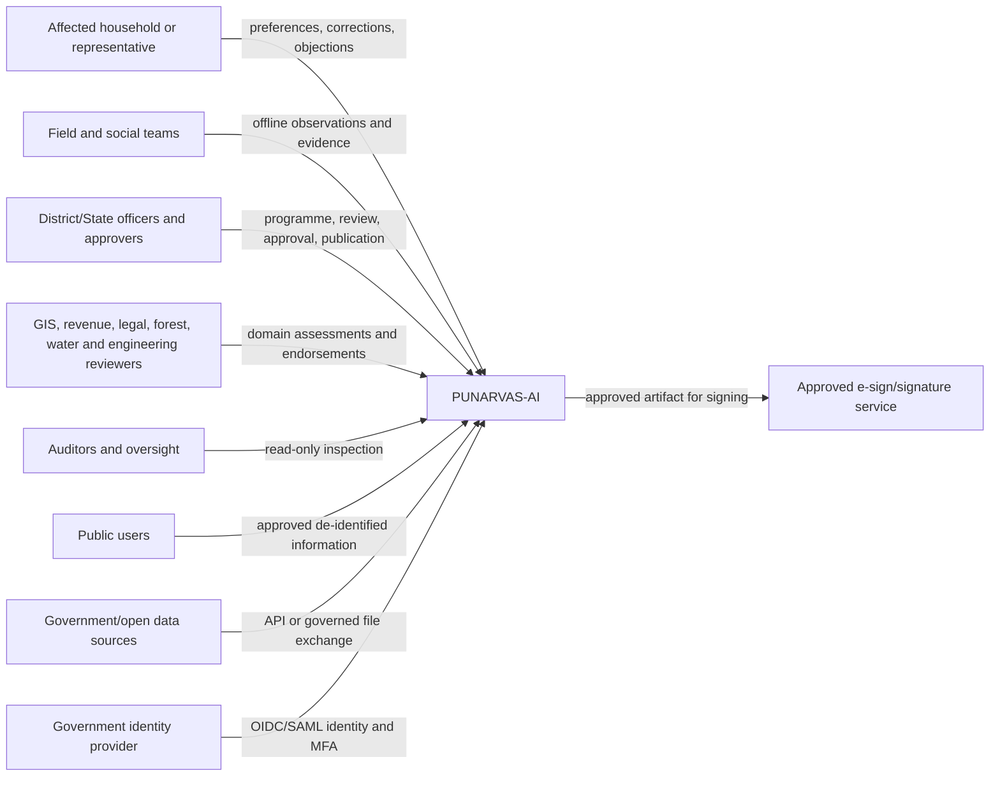
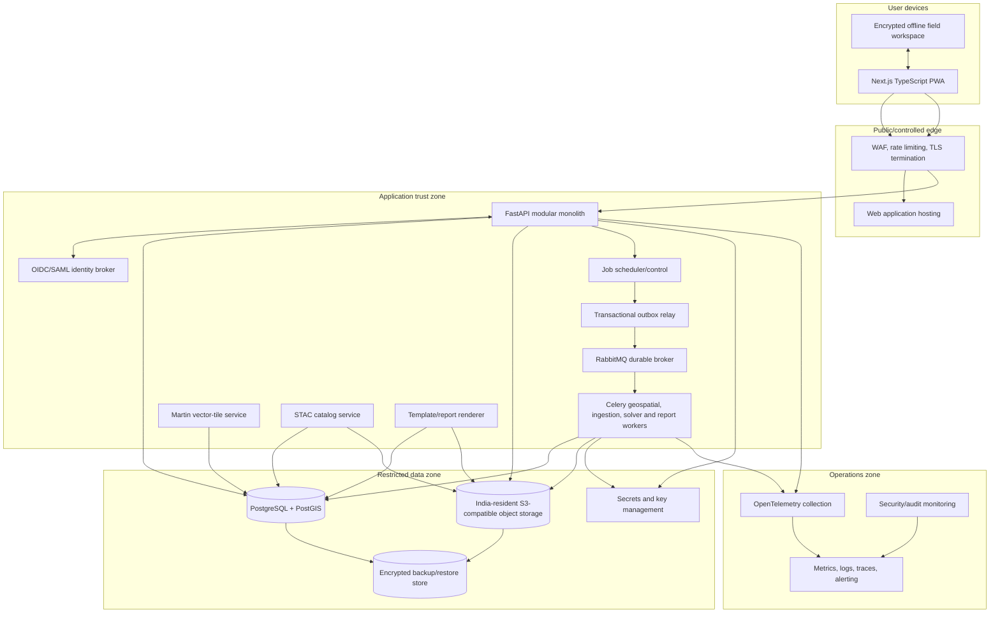
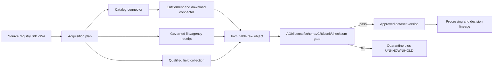
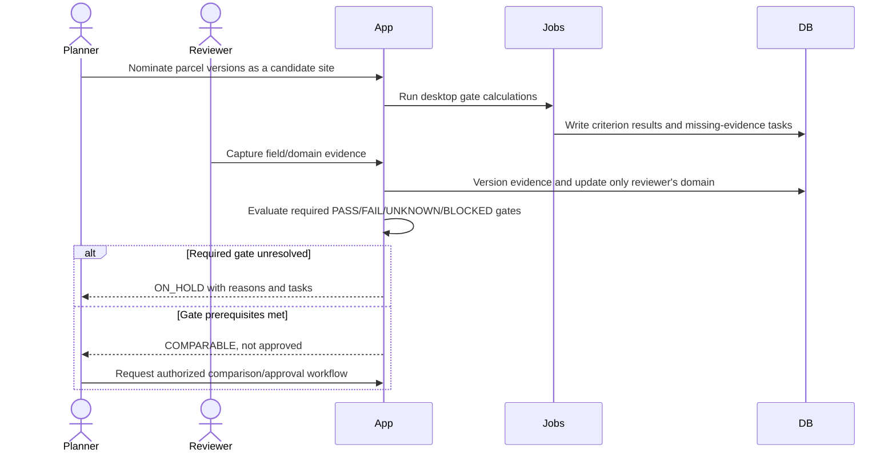
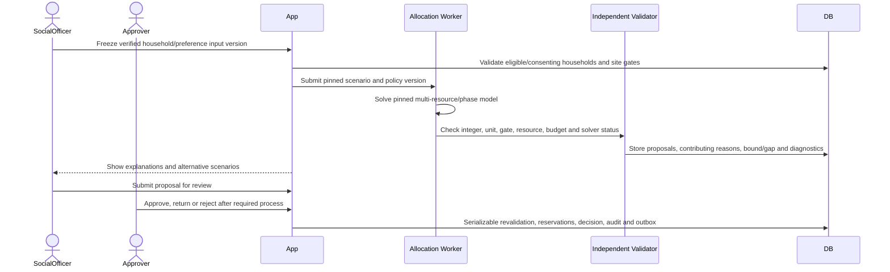

# PUNARVAS-AI System Architecture

## 1. Document boundary

This document describes **how the technical requirements in [trd.md](./trd.md) are realized**. It does not redefine product scope, legal/domain rules, acceptance thresholds, or feature behavior. Architecture decisions and rejected alternatives are recorded in [decisions.md](./decisions.md).

## 2. Architectural principles

1. **Advisory, evidence-first system:** every conclusion can be traced to source, processing, policy, review, and authority state.
2. **Modular monolith before microservices:** use explicit domain boundaries and asynchronous workers without accepting distributed-system cost prematurely.
3. **PostGIS as the spatial system of record:** preserve source and corrected geometries, bitemporal versions, and authorization scope together.
4. **Immutable-while-retained inputs, versioned facts:** source objects are never rewritten in place; database records supersede prior versions. Authorized expiry/deletion creates a tombstone and respects legal holds rather than using immutability to retain personal data indefinitely.
5. **Human authority at high-impact transitions:** automated jobs calculate, validate, compare, and recommend; authorized users decide and publish.
6. **Privacy and geography by construction:** personal records, restricted spatial records, public products, and logs have different trust/access paths.
7. **Interoperable at boundaries:** STAC, OGC API Features, GeoJSON/GeoPackage, MVT, COG, CSV, and documented JSON APIs prevent proprietary lock-in.
8. **Offline and file exchange are normal:** field connectivity and government API availability are not assumed.
9. **Map and non-map parity:** maps are a spatial interface, not the only way to inspect or act on evidence.
10. **No authoritative AI path:** the baseline contains deterministic rules, spatial processing, templating, and optimization; no LLM/voice decision component.

## 3. System context



The system does not connect directly to social media, live command sensors, rescue routing, fund-transfer rails, or automated gazette publication in the baseline.

## 4. Container architecture



## 5. Technology choices

| Area | Baseline choice | Purpose and boundary |
| --- | --- | --- |
| Web/PWA | Next.js with TypeScript | Accessible bilingual workflow UI, SSR where useful, installable offline field shell |
| Map | MapLibre GL JS | 2D vector/raster visualization without proprietary map-runtime dependency |
| Application | Python FastAPI modular monolith | Typed REST APIs and cohesive domain transactions; domain packages remain split-ready |
| Validation/contracts | Pydantic/OpenAPI plus database constraints | Shared API schemas and server-side validation; generated clients may consume OpenAPI |
| Persistence | PostgreSQL + PostGIS | Versioned relational and spatial record, geometry operations, row-level security |
| Migrations | Alembic-managed migrations | Forward/rollback-aware schema change with tested data transitions |
| Background processing | Celery workers with RabbitMQ | Durable asynchronous ingestion, raster/vector processing, comparison, allocation, and report work |
| Spatial processing | GDAL/PROJ-compatible workers plus PostGIS | Format/CRS validation, tiling, overlay, transformation, and reproducible jobs |
| Raster catalog | STAC service backed by catalog schema/object store | Asset discovery, lineage, temporal/spatial metadata, and standards-based exchange |
| Large vector rendering | Martin-compatible MVT service | Authorized server-side vector tiles from PostGIS; small bounded results may use GeoJSON |
| Object storage | India-resident S3-compatible versioned store | Original files, COGs, images, evidence, reports, and manifests; retention lock where policy requires |
| Identity | Keycloak-compatible identity broker for pilot | OIDC application identity and SAML/OIDC federation with approved government IdPs |
| Reports | Structured HTML/document templates and controlled PDF rendering | Accessible primary output, official-format mapping, deterministic evidence-bound text |
| Observability | OpenTelemetry with approved metrics/log/trace and SIEM backends | Correlated service/job health and security monitoring without personal-data leakage |
| Deployment | OCI containers; profile-specific orchestrator | Local/container prototype; approved India-hosted Kubernetes/OpenShift-compatible or equivalent controlled production; approved on-premises profile possible |

Product/business modules do not import vendor APIs directly. Adapters isolate identity, object storage, signature, notification, and government-data integrations.

Source access uses three deliberately separate layers:

1. **Source registry:** provider/product identity, S01–S54 classification, intended/non-intended use, license, coverage, and responsible owner.
2. **Connector plane:** discovery, authentication/entitlement, download or governed receipt, retry/quota/cost control, and health. CDSE catalog, download, and processing endpoints are separate connectors; Earth Search and Planetary Computer are alternate delivery routes; Earth Engine is optional processing; Bhoonidhi and NWDP use documented resource-specific connectors.
3. **Evidence pipeline:** immutable object capture, validation, normalization, cataloging, lineage, review, and approval. Only this layer can create a decision-usable dataset version.

Display basemaps terminate in the presentation layer and cannot enter analytical lineage. Mirror/shared-observation identities are resolved before processing, so two catalogs exposing one Sentinel acquisition or overlapping footprint sets do not become false corroboration.

## 6. Application domain modules

| ID | Module | Owns | Does not own |
| --- | --- | --- | --- |
| ARC-C01 | Programme, access, and compliance context | Programmes, jurisdictions, authorities, role assignments, workflow/publication profiles, legal instruments and effective-dated obligations | Identity passwords, legal advice, or statutory authority |
| ARC-C02 | Catalog and ingestion | Dataset/evidence metadata, validation, versions, lineage, quarantine, processing runs | Domain approval of the evidence's meaning |
| ARC-C03 | Hazard and exposure | Hazard-layer adapters, zone versions, overlays, exposure estimates, uncertainty | Custom authoritative hazard-model training |
| ARC-C04 | Land truth and legal readiness | Parcel/geometry versions, record interests, occupation/use discrepancies, claims, legal review | Conclusive title adjudication |
| ARC-C05 | Site assessment | Candidate sites, criterion/gate results, field/domain reviews, capacity and cost versions | Household eligibility or allocation approval |
| ARC-C06 | Household and participation | Household/member history, deduplication, necessity/eligibility/priority, purpose-specific participation, preferences and acceptance | Public disclosure profiles |
| ARC-C07 | Policy, formula, and comparison | Effective-dated rule/formula/parameter activation, MCDA criteria/weights, numerical validation, contribution and sensitivity | Hard-gate overrides or specialist-model approval |
| ARC-C08 | Allocation and reservation | Versioned MILP inputs, constraints, diagnostics, independent feasibility validation, atomic resource reservations and unassigned explanations | Official allocation authority |
| ARC-C09 | Governance and remedy | Tasks, SLA reminders, objections, hearings, decisions, separate approvals/notices, holds/stays, escalation recommendations | Automatic authority bypass |
| ARC-C10 | Reporting and publication | Templates, dossiers, LSG annex mapping, export manifests, public projections | Creation of facts absent from structured records |
| ARC-C11 | Audit and assurance | Append-only audit events, hash linkage, verification, authorized audit views | Business-record mutation |
| ARC-C12 | Scheme, funding, and completion | Scheme versions, entitlement assessments, funding states, readiness milestones, handoff and follow-up | Payment execution, construction management, or unsupported completion claims |
| ARC-C13 | Source access and health | S01–S54 capabilities, endpoints, entitlement, credentials references, quotas/costs, acquisition attempts, mirror groups, freshness, fallbacks and readiness reports | Treating provider documentation/catalog visibility as usable evidence or interpreting source content |

Modules communicate inside the application through explicit service interfaces and domain events. A module cannot update another module's tables directly. Cross-module orchestration records a command, result, correlation ID, and audit event in one controlled transaction or an idempotent asynchronous workflow.

The database owns a transactional outbox. Any committed business change requiring background work writes the business change, audit event and outbox command atomically. A relay publishes stable message IDs; consumers deduplicate and record effects. Reconciliation detects unpublished, abandoned and partially applied work. Queue acknowledgement is never proof of completed business state.

## 7. Data architecture

### 7.1 Storage separation

- **PostgreSQL/PostGIS:** canonical metadata, domain records, geometries, states, relationships, approvals, audit index, and job control.
- **Restricted personal schema:** household/member fields with tighter roles, policies, encryption/tokenization, and export controls.
- **Object storage:** immutable original inputs and versioned derived artifacts. Database rows reference object version and checksum; objects do not carry authorization by URL alone.
- **STAC catalog:** discoverable imagery/raster metadata and asset links, filtered through authorization.
- **Public projection:** separately generated, approved, minimal records. Public requests never query unrestricted household/legal tables directly.
- **Backup store:** encrypted, access-separated copies of database/object metadata and content, remaining within approved residency boundaries.
- **Reservation ledger:** serializable/locked reservations across programmes, overlapping parcel groups, dwellings, persons, accessibility resources, budgets and shared services; draft scenarios never write it.
- **Formula/policy registry:** immutable activation records pin formula, parameter, policy, software and test-evidence versions; specialist or rejected methods are not loadable through ordinary configuration.
- **Source capability registry:** stable S01–S54 records, endpoint/entitlement state, acquisition attempts, shared-input/mirror groups, dependency mappings, source health, and release-readiness snapshots. Secrets remain in the key manager, not the registry.

### 7.2 Versioning and time

Business facts use bitemporal semantics:

- `valid_time` expresses when the fact applies in the real/programme world.
- `system_time` expresses when PUNARVAS-AI stored or superseded it.
- `version_id` pins the exact record used by an analysis or export.

Source geometry and normalized/corrected geometry are distinct versions. Storage/display may use EPSG:4326 where suitable; metric operations use a reviewed projected CRS through explicit transformation. Derived geometry stores processing CRS and transformation lineage.

### 7.3 Audit model

The application writes a business change and corresponding audit event atomically. Each audit stream records previous event hash, canonical event hash, actor/service, authority scope, action, target/version, time, reason, and correlation ID. Periodic signed checkpoints and export manifests make tampering detectable. Administrators cannot edit old events through application APIs; corrections create compensating events.

This is tamper-evident append-only logging, not blockchain and not a claim that infrastructure administrators are cryptographically incapable of deletion.

## 8. Major runtime flows

### 8.1 Source discovery and acquisition



Connector families are configured rather than embedded in domain code: STAC/OData and signed-asset download; WMS/WMTS display or permitted export; resource-specific REST; registered portal/manual download; governed agency file transfer; and secure field acquisition. Network/catalog success updates connector health but never bypasses the AOI gate. Credentials are scoped and retrieved at runtime from the key manager. Version-addressed cached assets are used only within license and freshness rules.

The public-data sandbox starts from S01–S44 selections plus synthetic people/parcels. S45–S50 enter through restricted agency/field paths and are required before the affected production transitions. S51–S54 remain optional, conditional, display-only, or procured extensions and have no hidden baseline dependency.

### 8.2 Dataset ingestion and derived exposure

```mermaid
sequenceDiagram
    actor Analyst
    participant API
    participant Store as Object Store
    participant Outbox as DB Outbox
    participant Queue as Job Queue
    participant Worker
    participant DB as PostGIS/Catalog

    Analyst->>API: Register source metadata and upload/import request
    API->>Store: Store immutable original; calculate checksum
    API->>DB: Atomically create RECEIVED version, audit and outbox command
    Outbox->>Queue: Relay validation command with stable message ID
    Worker->>Store: Read pinned object version
    Worker->>Worker: Malware/schema/CRS/geometry/license checks
    Worker->>DB: Quality report and VALIDATED or QUARANTINED
    Analyst->>API: Approve version for configured use
    API->>Queue: Enqueue derived processing
    Worker->>DB: Read pinned sources; transform/overlay
    Worker->>Store: Store derived artifact and manifest
    Worker->>DB: Write lineage, uncertainty and analytical result
```

### 8.3 Candidate site review



### 8.4 Household allocation scenario



If preferences, evidence, court/objection state, readiness or capacity changed after the scenario snapshot, approval fails closed and creates a replan task. Reservation expiry, release and commitment are governed transitions, not solver side effects.

### 8.5 Formula and policy execution

The policy service resolves one approved `policy_formula_activation` for the programme, action and effective time. It loads immutable formula/parameter versions, validates units, CRS/time support, coverage, domains and missing values, then dispatches only to an allow-listed implementation. The result stores inputs, software container/version, numerical warnings, uncertainty and reviewer state. `OPTIONAL` output is visibly analytical; `SPECIALIST/EXTERNAL` output is ingested as versioned evidence; `REJECTED` methods have no executable binding. Promotion requires the fixtures in [equations.md](./equations.md) and an approval recorded through ARC-C07.

## 9. Trust boundaries and security design

### 9.1 Boundaries

1. **Public boundary:** approved public projection only; WAF, rate limits, no direct database/object access.
2. **Authenticated user boundary:** identity broker issues short-lived claims; API re-evaluates role, programme, geography, state, and classification.
3. **Restricted personal/legal boundary:** separate schema/policies/keys; ordinary GIS and support roles cannot read restricted fields.
4. **Worker boundary:** workers receive object/version references and scoped service credentials; jobs cannot assume the submitting user's broad access.
5. **Integration boundary:** every external API/file source is untrusted until validation; egress is allow-listed and logged.
6. **Operations boundary:** infrastructure access is separate from business approval; break-glass access is time-bound and reviewed.

### 9.2 Authorization enforcement

- The identity layer authenticates; the application authorizes; PostgreSQL RLS provides a final record-scope guard.
- Table owners and superusers are not application runtime identities because they can bypass RLS.
- Object download uses short-lived, authorization-checked delivery; bucket paths are not public capability tokens.
- Approval, publication, restricted export, policy activation, and break-glass actions require step-up MFA.
- Public artifacts are generated into a separate prefix/projection after disclosure review, not redacted on every public request from the restricted source.
- Public projection generation applies a documented inference threat model covering small cells, differencing across versions/filters, linkage to external data and precise geography. Suppression/generalization and query/release controls are policy-versioned; the architecture does not promise that removing names alone prevents re-identification.
- One policy-enforcement layer or signed scoped entitlement protects APIs, search, vector tiles, STAC results, COG/object range reads, report downloads and cache lookups. Cache keys include programme, geography, classification, publication/version and principal scope; restricted data never enters a public cache.
- Tile/catalog/object identities are narrowly scoped. Tests cover RLS owners, superusers, `BYPASSRLS`, views/security-definer functions and pooled-connection context reset.

## 10. Offline architecture

The PWA downloads only assigned forms, minimal reference maps, and necessary records into an encrypted device store with expiry. Each package has a device/user/programme binding and a server-issued package version. Each release defines supported devices/browsers, key wrapping/unlock, idle and logout deletion, shared-device behavior, XSS/CSP controls, quota/eviction handling, attachment limits and recovery of unsynced evidence.

Offline writes use client-generated UUIDs, form version, device time, evidence hashes, GPS accuracy, and a monotonic local sequence. Sync sends idempotent commands. The server records receipt time and detects a changed base version. Non-overlapping additions may merge; conflicting substantive assertions create a supervisor task preserving both versions.

Lost-device response revokes future tokens and packages where reachable. Expired local data is purged when the client runs, but neither remote wipe nor browser-storage persistence is guaranteed while a device remains offline. The UI shows unsynced item count, last sync, expiry and eviction risk; a controlled encrypted recovery/export path is available to an authorized supervisor where supported.

## 11. Reporting and publication architecture

- Reports are assembled from pinned structured records and evidence references, not free-form generated claims.
- Templates are versioned and tested with reference fixtures.
- Accessible HTML is the canonical review representation. PDF/office-document renderings are controlled derivatives and undergo accessibility/format checks appropriate to their use.
- An export manifest records content hashes, source/policy/template versions, confidentiality, unresolved conditions, authority state, and generator.
- Digital signature integration signs an approved artifact through the authorized service/user; report generation itself does not claim approval.
- Kerala LSG export maps fields to the approved template while leaving participatory and externally approved content clearly incomplete until supplied.

## 12. Deployment topology

### 12.1 Deployment profiles

| Profile | Purpose | Minimum shape | Prohibited claim |
| --- | --- | --- | --- |
| Prototype | Demonstrate the bounded flow with synthetic/public data | Reproducible local/container deployment; single-node services permitted | No official decision, production SLO, scientific validation or compliance certification |
| Authorized pilot/shadow | Exercise approved workflows and data without replacing authority | Hardened India-resident environment, identity/MFA, backups, monitoring, support, controlled devices and agreements | No official output solely because shadow software produced it |
| Controlled production | Bounded authorized decision support | Approved multi-failure-domain Kubernetes/OpenShift-compatible or equivalent platform, staffed operations and independent assurance | No expansion beyond the approved programme/geography/workflow |

Kubernetes/OpenShift is not a prototype requirement. Hosting, staffing, procurement, data agreements and budget are phase gates. The basemap provider, style/source versions, attribution, license, usage limits, offline rights, availability and fallback must be approved; MapLibre is only the renderer.

### 12.2 Controlled production

- One India-resident production cluster across multiple failure domains where the selected hosting environment permits.
- Separate namespaces/accounts for web, application/workers, restricted data services, observability, and security operations.
- Managed or hardened PostgreSQL/PostGIS with point-in-time recovery; S3-compatible versioned object store; durable broker.
- Public ingress separated from administrative ingress; databases, broker, tile, STAC, and object administration have no public endpoint.
- Non-production environments use separate keys, identities, networks, and sanitized data.

### 12.3 Recovery

- Database continuous archiving plus scheduled full backups.
- Object versioning, replication/backup, manifest inventory, and periodic integrity sampling.
- Infrastructure/configuration and schema migrations are reproducible from version control.
- Quarterly restore exercises verify `NFR-007/008/032` by restoring a consistent database point, object inventory/versions, outbox/job state, audit checkpoints, signing/encryption keys and manifests. Missing referenced evidence blocks authoritative restart. Annual or material-change failover also verifies people and runbooks.
- Degraded mode serves recently approved read-only outputs when safe; editing/approval is disabled if authoritative persistence or audit cannot be guaranteed.

## 13. Scaling strategy

1. Partition/query/index by programme, jurisdiction, state, time, and geometry; use spatial/generalized indexes and precomputed approved views.
2. Serve bounded GeoJSON only; use vector tiles and COG range access for large layers.
3. Scale workers by queue (ingestion, raster, spatial, solver, reports) and resource class; enforce per-programme quotas.
4. Cache only non-sensitive, version-addressed results; authorization-sensitive caches include programme/geography/classification keys.
5. Archive cold versions to object storage while retaining searchable metadata and reproducibility.
6. Add read replicas for authorized reporting before splitting write domains.
7. Extract a module into a service only when independent scaling, security isolation, release ownership, or availability evidence outweighs transaction/operations cost. The first likely candidates are tile delivery and heavy geospatial processing, which are already isolated processes.

## 14. Failure design

| Failure | System response |
| --- | --- |
| External government API unavailable | Use last approved version with visible age/coverage or governed file import; never label stale data current |
| Catalog works but download/authentication fails | Record catalog visibility separately, keep the asset unacquired, apply backoff/credential workflow, and hold dependent use |
| Provider quota/cost limit reached | Stop scheduled acquisition within budget, expose quota/cost state, and use only an approved equivalent route or governed file fallback |
| Paused/deprecated endpoint | Suspend that connector (including SoilGrids REST or legacy SciHub); migrate only through a tested replacement such as WCS/files or CDSE |
| Duplicate/mirrored observation | Resolve provider item identity/checksum/time/footprint into a mirror group and process once unless an approved comparison purpose requires otherwise |
| Ingestion validation fails | Quarantine object/version; retain report; exclude it from approved processing |
| Worker/job crashes | Retry idempotently within policy, then dead-letter and create operator task; no partial business result becomes approved |
| Broker unavailable | Reject or persist pending job commands safely; interactive reads continue where possible |
| Database unavailable/read-only | Disable writes/approvals; serve approved read-only artifacts if integrity is known |
| Object missing/checksum mismatch | Block dependent result/export and raise integrity incident |
| Conflicting field sync | Preserve both records and route human resolution; no last-write-wins |
| Source/policy superseded | Flag affected analytical results for review; do not silently recompute an official decision |
| Identity provider unavailable | Existing short-lived sessions may continue only per security policy; no insecure local fallback for privileged actions |
| Public projection error | Withdraw affected projection/artifact, preserve audit, notify owner, and regenerate after disclosure review |
| Allocation infeasible | Return diagnostics and unassigned cases; never weaken mandatory constraints automatically |

## 15. Architecture-to-requirement mapping

| Concern | Components | Principal requirements |
| --- | --- | --- |
| Programme/access/compliance | ARC-C01, identity broker, RLS | FR-001–005, FR-075, NFR-012–013, NFR-033 |
| Source access/readiness | ARC-C13, connector workers, key manager, source registry | FR-076–084, NFR-034–035 |
| Provenance/ingestion | ARC-C02, workers, object store, catalog | FR-006–011, FR-078–080, NFR-010 |
| Hazard/exposure | ARC-C03, PostGIS, STAC, tile service | FR-012–018 |
| Land/site truth | ARC-C04–C05, field PWA | FR-019–031, FR-059–062 |
| Household/participation | ARC-C06, restricted schema | FR-032–038, NFR-014, NFR-017 |
| Policy/allocation | ARC-C07–C08, solver and independent validator | FR-039–046, FR-071–074, NFR-009–010 |
| Scheme/funding/completion | ARC-C06, ARC-C09, ARC-C12 | FR-063–070 |
| Remedy/authority | ARC-C09 | FR-047–052, FR-070, FR-075 |
| Reports/audit | ARC-C10–C11, renderer, object store | FR-053–058 |
| Accessibility/localization | Web/PWA and report renderer | NFR-019–022 |
| Operations/continuity | Outbox, cluster, observability, coordinated backup | NFR-006–008, NFR-023–033 |

## 16. Primary references

1. [OGC API Features](https://www.ogc.org/standards/ogcapi-features/)
2. [STAC API Community Standard](https://docs.ogc.org/cs/25-005/25-005.html)
3. [PostgreSQL row security](https://www.postgresql.org/docs/current/ddl-rowsecurity.html)
4. [PostGIS `ST_Transform`](https://postgis.net/docs/ST_Transform.html)
5. [MapLibre GL JS](https://maplibre.org/maplibre-gl-js/docs/)
6. [Indian Guidelines on Geospatial Data, 2021](https://dst.gov.in/sites/default/files/Final%20Approved%20Guidelines%20on%20Geospatial%20Data.pdf)
7. [GIGW 3.0](https://guidelines.india.gov.in/gigw3/)
8. [WCAG 2.2](https://www.w3.org/TR/WCAG22/)
9. [Celery task guidance](https://docs.celeryq.dev/en/stable/userguide/tasks.html)
10. [Browser storage quotas and eviction](https://developer.mozilla.org/en-US/docs/Web/API/Storage_API/Storage_quotas_and_eviction_criteria)
11. [Equation Registry](./equations.md)
12. [Source Register](./source-register.md)
