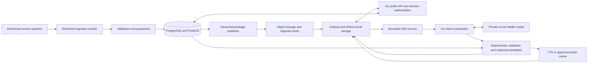

# Target architecture

2026-09-19 · Go application backend; mobile architecture pending P8. See [tech-stack.md](tech-stack.md) for selections and [cleanup.md](cleanup.md) for the current repository.

## Component boundaries

Logical components do not require a separate microservice each. Begin with one Go codebase, separate API and ingestion/job process roles when their trust/resource boundaries require it, PostgreSQL/PostGIS, static delivery and isolated model workers. Use explicit packages, not a generic plugin platform. No Kafka/service mesh/multi-region writes unless measured requirements justify them.

## Data and responsibility

- Go owns sessions/authorization, source state, package versioning, eligibility, citizen selection, reservations/stays, durable idempotency, event/outbox commits, response templates and model-output validation.
- PostgreSQL owns committed capacity and policy-bound state. Transactions lock/compare affected facility/date rows and persist request/result plus audit/outbox together. Read replicas may serve suitable published facts but cannot authorize capacity writes from stale balances.
- Ingestion credentials are isolated per source and read-only where possible. Fixed endpoints only; restrict redirects, DNS/IP ranges, egress, request rate, body/decompression limits and parser time. Neither a citizen-supplied URL nor an LLM can control source fetching.
- A publisher validates and signs an immutable incident package and a small active-version manifest. Private assignment data is never put in public CDN objects. CAP raw artifacts stay restricted; public projections contain only necessary fields.
- The phone stores UI/assets, selected language packs, regional gazetteer, permitted map data and verified guidance. Device location is handled by OS permission and deterministic geometry matching; the model gets only necessary candidate IDs/context.
- Operator functions require jurisdiction-scoped roles and MFA. Protect publish/revoke/capacity correction workflows independently from citizen endpoints. Minimal operator workflow is necessary for integration readiness even though citizen frontend implementation is deferred.

## Voice-to-action sequence

1. User taps Speak; app captures bounded audio with clear stop/cancel and transcript alternative. Upload binary compressed audio when negotiated, not base64 JSON by default.
2. ASR returns text, language and calibrated confidence if available. Unknown confidence remains null. Noise, truncation, unsupported language and ambiguity are explicit outcomes.
3. Go obtains only relevant active incident/place/destination candidates. Match administrative IDs, aliases and approximate location only with permission. Duplicate village names cause clarification.
4. The middle model returns a small intent/ID/action/template proposal following [voice-map-system-prompt.md](voice-map-system-prompt.md). Simple direct camera buttons/local commands bypass inference.
5. Go rechecks every ID, scope, version, expiry, action type and selection prerequisite. Database rules determine eligible choices; model prose cannot override them. Stale responses to cancelled/older requests are discarded.
6. Client applies validated display actions to its current package. Reservation/arrival/call confirmation uses a separate explicit user gesture and endpoint.
7. Go resolves optional speech from reviewed templates plus verified facts; TTS does not decide content. Silent map movements need no spoken acknowledgment. Result and clarification audio can be cancelled/repeated.

## Maps: renderer, data, routing and incident truth are different

MapLibre Native is a renderer with offline-region support. It does not include free production tiles or prove road conditions. Prefer restrained vector maps: streets, water, locality names and landmarks. Download bounded district/incident regions, necessary fonts/glyphs/sprites and style resources together. Use built-in offline-region support first; do not assume an MBTiles/PMTiles file works identically on both platforms without a tested integration.

Use self-hosted or licensed tiles with offline redistribution rights. OpenStreetMap data may be a candidate after attribution/ODbL and hosting review. The public `tile.openstreetmap.org` service prohibits bulk/offline downloading and is not the backend for a million-user app. Public Nominatim/Overpass endpoints likewise are not presumed high-volume production services.

Google is not inherently slower than open-source maps; network payload, cache hit rate, geometry and device rendering determine latency. Google Map Tiles policies restrict offline/prefetch use, so Google is not the default for this offline-first design. Any Google SDK option requires a separate product-specific terms review; do not generalize Map Tiles terms to every Maps product. Compare matched cold/warm regional maps on real phones and the same network before declaring either faster.

Keep hazard polygons/route geometry in a separately versioned incident layer. A base road map can be old without changing the official incident version, but must show age/attribution. Map failure leaves the emergency card and directions usable. Do not require imagery, 3D terrain or continuous tile downloads.

## How a route could be established

The user left route authority open. Build the import/validation boundary now; postpone operational activation until O05 closes. Three possible approved workflows are: authority supplies complete routes; qualified local responders validate candidate road segments/routes; or a routing engine proposes candidates followed by the required authority validation. None is silently chosen as government policy.

A self-hosted routing engine such as Valhalla or GraphHopper can use a permitted road graph to suggest walking/vehicle routes. This is optional preparation tooling, not an emergency safety oracle or required citizen runtime. Evaluate it only if the chosen authority workflow needs candidate generation. Verify exact engine support before depending on exclusions/vehicle constraints.

Road graph attributes such as `highway`, `surface`, `smoothness`, `tracktype`, `incline`, `steps`, `bridge`, `ford`, `access`, vehicle restrictions and width provide clues. Licensed elevation data can add terrain context. Missing tags, elevation resolution or satellite imagery cannot establish bridge integrity, flood depth, debris or current passability. Local knowledge needs a documented reporting/validation process. User reports can withdraw confidence or request verification; they cannot certify a new route as safe.

Each published route carries incident/jurisdiction, origin/assembly area, destination, transport mode, accessibility constraints, geometry, landmarks, verification actor/time, effective/expiry times, closures/version and approval evidence. Validate connected endpoints, direction, declared CRS/coordinates and source relationships. An approved exit may start inside the red zone; do not reject every intersecting route or authorize every line that leaves the polygon. Only known route lengths may be compared; unknown routes are not assigned optimistic time/surface labels.

## Offline and consistency

Use a small signed manifest to discover changed packages, ETag/conditional fetch, resumable downloads and atomic verified swaps. Never replace last-good data with partial downloads. Persist cancellation tombstones and monotonic versions. Expiry is enforced locally with clock-uncertainty handling; do not trust a user-adjusted clock to extend life indefinitely. Revocation cannot arrive while disconnected: show last-sync age and fail closed at the agreed expiry. A 7–30 day stay does not imply a route remains valid for 30 days.

Keep on-device assignment operations pending until acknowledged. On reconnect, revalidate source/package and eligibility before committing; expired queued choices require renewed confirmation. Use stable idempotency keys for ambiguous retries. Avoid background precise-location uploads.

## Scale and deployment

Cache public read-only packages near users and on devices; poll government sources once per authorized schedule rather than once per citizen. Bound reads by geography/version, paginate operators and use spatial indexes. Capacity hotspots need transaction-level contention tests. Model and map traffic must not starve guidance reads or ledger writes.

Use load-balancing, at least the redundancy required by the availability target, backup/PITR and tested restore/failover before readiness. No fixed server/GPU count until [equations.md](equations.md) is populated from measured load. Deploy demo fixtures in the same software paths with separate identities/data; do not build a second fake application for demos.
