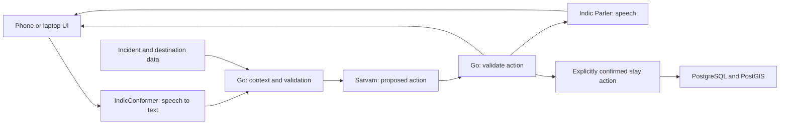

# Round two: working demo first

Accepted user priority change, 2026-09-21. Round two is September 28–29. Round three is expected roughly 25–30 days from this decision; exact date is unconfirmed.

## What we are building, in plain language

Sthira helps people understand an incident, choose an evacuation destination, and arrange an immediate or temporary stay. It does not predict hazards, invent safe land, or certify road safety. In a real deployment, responsible authorities supply those facts. In the hackathon we use explicitly labelled exercise data.

A person speaks in a supported language. IndicConformer-600M-Multi turns their audio into text. Sarvam-30B (about 2.4B active non-embedding parameters) interprets the request and proposes a structured action, such as showing destination choices. Go code checks that proposal against the supplied incident data before the UI acts. Indic Parler-TTS speaks a response when speech is useful. The model does not directly write reservations or decide which land is safe.

The backend is a modular Go service, not a requirement to operate dozens of microservices. PostgreSQL stores incident packages, authorization, stays, inventory, and audit history; PostGIS supports geographic data. The AI workers run separately so their Python/model dependencies do not live inside the Go service. HTTP joins the components. Offline packages support cached information, interrupted downloads, and reconnection. Those foundations are useful, but judges need a coherent visible journey rather than every backend feature.

The existing JavaScript/TypeScript frontend is a reference/demo starting point. A finished Android+iPhone product and a polished responsive round-two UI are not established by backend tests. A responsive web demo is the recommended shortest route to showing the same experience on laptop and phone; it does not settle the later native-app framework choice.

## Temporary sequencing override

Preserve the production architecture, prior implementation, and P0–P12 roadmap. Gate B remains NOT_READY. The previous rule that all frontend work must wait for Gate B is superseded for the round-two prototype only. Do not mark P8 production acceptance complete because a browser demo works.

Pause broad production hardening, new infrastructure, and repeated P4–P7 closure campaigns. Fix only defects on the selected demo journey, preserve validation and exercise labels, and keep other known gaps in the review backlog. Resume production gates after round two. Do not scrap PostgreSQL or rewrite the backend just to hide it from the judges.

## Round-two deliverables

1. One reliable, clearly labelled exercise journey: speak → identify place/incident → show map and destination choices → choose a destination → hear a concise explanation. Add a stay flow only if it is real and rehearsed; otherwise do not expose an active-looking control for it.
2. Run the actual three selected models on agreed hardware. Prove one end-to-end request before expanding UI scope. Adapter tests, mock responses, and health endpoints are not this proof. Hardware, model access, exact revisions, and language performance remain to be established.
3. A polished responsive interface on a laptop and a real phone: large readable controls, prominent microphone, accessible text/touch fallback, simple map, clear loading/error states, and no needless animations.
4. One coherent case first, with user-approved demo geography and language. The eventual 10–15-state catalogue remains planned; do not fabricate coverage for the pitch. Add more cases only after the first works reliably.
5. A concise deck explaining the problem, user journey, live demo, architecture, current evidence, limitations, and round-three plan. Clearly distinguish working capabilities from planned capabilities.
6. A rehearsed recovery path for unreliable internet. Any recorded backup must be labelled as a recording, not presented as live inference.

## Suggested sequence through September 29

- First: founder/team walkthrough of this file; select the single case and demonstration language; establish real-model hardware/access and run the voice pipeline.
- Next: fix the bounded demo integration issues listed in the review; build the responsive map/voice journey against actual endpoints and labelled exercise fixtures.
- In parallel with UI: prepare the deck, demo script, and architecture explanation from verified behavior.
- Before the event: test the exact laptop/phone/network setup, rehearse, freeze features, and preserve a reproducible runbook and clearly identified backup recording.

Calendar pressure does not turn synthetic data into authority or unexecuted model adapters into working models. Round-three production readiness will require real security, load, recovery, model/language and operational evidence; it cannot be guaranteed solely by a deadline.

## What exists now

- Go contracts, source ingestion, PostgreSQL/PostGIS storage, authorization, immediate/temporary stay logic, and offline delivery implementation.
- ASR/middle/TTS worker protocols, adapter implementations, orchestration, evaluation and operational scripts.
- An experimental Go deployment package and an offline scenario preparation CLI.
- Extensive automated checks, including real database and HTTP paths.

What is not yet demonstrated: a complete live three-model user journey, production-quality regional language performance, the new polished UI, deployment-image operation, or production readiness. See [integration review](reviews/review-four-workers-round-two-2026-09-21.md) for concrete findings and verification limits.
