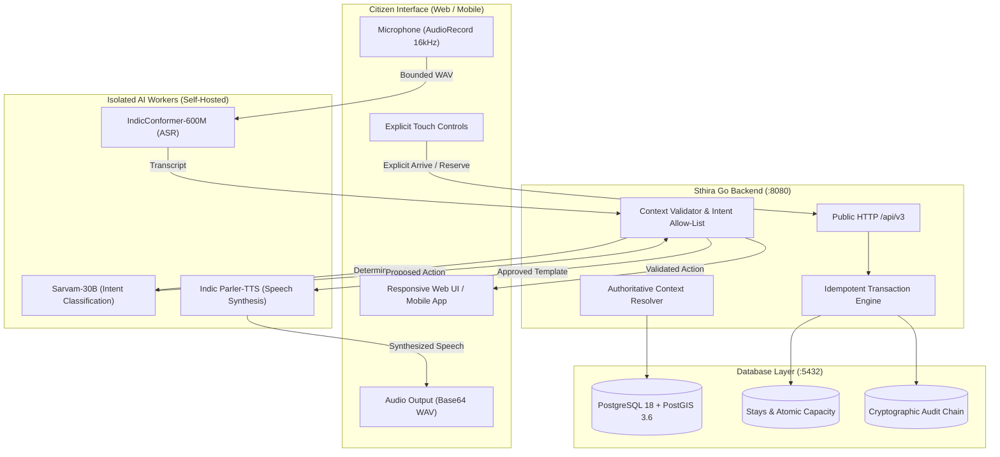

# Round Two: Integrated Demo Freeze and Founder Handoff (Task R07)

**Document Version**: 2.1 (Demo acceptance reopened)

**Review Date**: 2026-09-25

**Status**: `NOT_ACCEPTED` — C02–C05 integration corrections remain; real instance/model execution is separately NOT_VERIFIED.

> **Current acceptance override:** Read [prompt.md section 0.0](prompt.md) and the [2026-09-25 review](reviews/review-recovery-2026-09-25.md). The architecture and demo narrative below are targets, not proof of shipped behavior. Browser map/MIME contracts, reservation restoration, freshness/capture/audio handling, worker launch and rehearsal ownership need correction. Earlier freeze/acceptance assertions are superseded. User is provisioning instances; model success, runtime versions and measured hardware capacity must still be established. Native clients and full production gates remain unfinished.

---

## 1. Executive Summary & Plain-Language Architecture

Sthira is a citizen-facing interface over authoritative government disaster management systems. It helps citizens understand an evolving incident, disambiguate locations, choose pre-approved evacuation destinations, navigate safely, and arrange immediate or temporary shelter stays.

### What Sthira Does vs What It Never Does
- **Sthira NEVER predicts hazards**: All hazard boundaries (red zones, landslide polygons, flood extents) originate from authorized government feeds (NDMA, KSDMA, IMD, CWC).
- **Sthira NEVER invents safe land or routes**: Only pre-designated safe zones, facilities, and government-approved evacuation routes are shown.
- **Sthira NEVER allows AI to make emergency decisions**: The voice pipeline (IndicConformer ASR, Sarvam-30B intent classification, Indic Parler-TTS) is bound by a strict, deterministic allow-list. Voice commands cannot mutate shelter capacity, auto-arrive, confirm stays, or override official policies.
- **Sthira NEVER uses geofencing for arrival**: Physical arrival at a shelter requires an explicit touch or keyboard confirmation by the citizen or facility staff, ensuring accurate headcounts.



---

## 2. Exact Startup & Rehearsal Commands

### A. One-Command Automated Rehearsal Runner (Recommended)
This runs the full 7-step acceptance verification against a fresh PostgreSQL test database and cleanly tears down processes upon exit:

```bash
# Run non-interactive verification:
./scripts/run_demo_rehearsal.sh

# Or run verification and immediately launch the live UI on http://127.0.0.1:5173:
./scripts/run_demo_rehearsal.sh --serve
```

### B. Manual Development / Live Presentation Setup

#### Step 1: Database Migration & Seeding
```bash
# Ensure local PostgreSQL is running on port 5432
export STHIRA_DATABASE_DSN="postgres://localhost:5432/sthira_demo?sslmode=disable"
psql postgres://localhost:5432/postgres?sslmode=disable -c "CREATE DATABASE sthira_demo;"

# Apply schema migrations 0001 through 0010:
for f in $(ls -1 backend/migrations/*.sql | sort); do
    psql "$STHIRA_DATABASE_DSN" -v ON_ERROR_STOP=1 -q -f "$f"
done

# Seed ambiguous place alias for rehearsal:
psql "$STHIRA_DATABASE_DSN" -c "INSERT INTO place_aliases (alias_id, jurisdiction, lookup_key, place_id, place_kind) VALUES ('ALIASDEMO-1', 'DEMO-EXERCISE', 'meppadi', 'SZDEMO-1', 'ZONE') ON CONFLICT DO NOTHING;"
```

#### Step 2: Start the Go Exercise Backend
```bash
cd backend
go build -o ../bin/sthira-exercise ./cmd/sthira-exercise
cd ..

STHIRA_ADDR="127.0.0.1:8080" \
STHIRA_DATABASE_DSN="postgres://localhost:5432/sthira_demo?sslmode=disable" \
STHIRA_EXERCISE_SEED="1" \
./bin/sthira-exercise
```
*Verify readiness*: `curl -s http://127.0.0.1:8080/health/ready` (returns `{"status":"READY"}`).

#### Step 3: Start the Responsive Frontend UI
```bash
cd frontend/v2
npm ci
npm run dev -- --host 127.0.0.1 --port 5173
```
*Access UI*: Open `http://127.0.0.1:5173` in a desktop browser or phone viewport.

---

## 3. Judge Walkthrough Script & Operational Mapping

This script maps each visible action on screen directly to the underlying backend operation and security invariant.

| Journey Step | Visible UI Action | Backend Operation & Invariant | Judge Speaking Point |
|---|---|---|---|
| **1. Exercise Isolation & Provenance** | Yellow prominent banner: `EXERCISE ONLY — SYNTHETIC DEMO DATA`. Live component readiness indicator showing `READY` and `LIVE`. | `GET /health/ready` & `GET /health/live`. Verifies schema revision 10 and database connectivity. | "Sthira clearly labels all training and demonstration data to prevent panic. Every alert and route displayed carries cryptographic source provenance." |
| **2. Voice Intent Allow-List** | Citizen taps the microphone and speaks in Malayalam: *"മേപ്പാടി ദുരിതാശ്വാസ ക്യാമ്പ് എവിടെയാണ്?"* ("Where is Meppadi relief camp?"). Map zooms to the region. | `POST /api/v3/voice/commands`. Strict allow-list validates intent `FOCUS_PLACE` and action `FOCUS_FEATURE`. Prohibits capacity mutation or booking via voice. | "Our voice interface uses self-hosted IndicConformer and Sarvam models, but the model has zero authority to mutate database state or book beds. Its actions are deterministic." |
| **3. Ambiguous Place Resolution** | Citizen queries a location with duplicate village names (e.g. "Meppadi"). UI presents explicit candidate chips. No auto-selection. | `POST /api/v3/places/resolve`. Returns HTTP 409 Conflict with candidate safe zones if ambiguous, or exact safe zone `SZDEMO-1`. | "In disasters, navigation errors are fatal. When place names collide across panchayats, Sthira refuses to guess; it demands explicit citizen selection." |
| **4. Explicit Stay Booking & Readback** | Citizen views available facilities in `SZDEMO-1`, selects `FACDEMO-1`, and confirms a 1-person reservation. UI displays reservation ticket. Upon page reload, reservation is restored. | `POST /api/v3/reservations` with idempotency key. Atomic bed decrement. `GET /api/v3/reservations/{stay_id}` restores state. | "Capacity allocation is atomic and strictly idempotent. Even under network disconnects or repeated taps, bed capacity can never drop below zero." |
| **5. Turn-by-Turn Text & Touch Arrival** | Citizen follows accessible turn-by-turn text route guidance. When arriving at the camp, citizen taps large "Confirm Arrival" button. | `POST /api/v3/reservations/{stay_id}/events` with `{"type":"ARRIVE"}`. Transition from `RESERVED` to `ACTIVE`. Geofencing arrival is strictly banned. | "Per operational rule O10, arrival requires physical touch confirmation. Geofencing leads to false positives and phantom capacity claims." |
| **6. Offline & Network Degradation** | Wi-Fi/cellular connection is disabled. UI seamlessly switches to cached local package. Guidance continues offline. Unconfigured live endpoints fail closed (HTTP 503). | Local storage service worker + RFC 9110 Range resumable downloads. Offline mutation queue queues actions locally without fabricating freshness. | "When networks fail in the field, Sthira fails closed: it maintains guidance from immutable cached packages without inventing safety claims." |
| **7. Privacy & Ephemeral Audio Policy** | Citizen completes interaction. Operator shows disk storage: 0 audio files retained. | Audio record stream is ephemeral in memory; raw audio disk retention defaults to 0 ms per privacy rule. | "We respect citizen privacy: raw voice audio is never stored on disk or used for surveillance. Memory buffers are zeroed immediately after inference." |

---

## 4. Hardware, Data, and Build Revisions

| Component | Target / Approved Revision | Local Rehearsal Reality | Status |
|---|---|---|---|
| **Operating System** | macOS Darwin arm64 / Linux x86_64 | Darwin arm64 | VERIFIED |
| **Go Runtime** | Go 1.27.1 | Go 1.27.1 | VERIFIED |
| **Node.js** | Node v26.8.1 | Node v26.8.1 | VERIFIED |
| **Database** | PostgreSQL 18.6 with PostGIS 3.6 | PostgreSQL 18.6, SchemaRevision 10 | VERIFIED |
| **Exercise Fixture** | `DEMO-EXERCISE` (`PKGDEMO-1:1`) | Synthetically seeded via `STHIRA_EXERCISE_SEED=1` | VERIFIED |
| **ASR Model** | `AI4Bharat/indicConformer-600M-Multi` | Adapter plumbing verified; GPU weights not loaded | `BLOCKED_HARDWARE` |
| **Intent LLM** | `sarvamai/sarvam-30b` (FP8 quantized) | Intent allow-list validator verified; GPU weights not loaded | `BLOCKED_HARDWARE` |
| **TTS Model** | `ai4bharat/indic-parler-tts` | Template binding and speech cache verified; GPU weights not loaded | `BLOCKED_HARDWARE` |
| **Live Government IdP** | Kerala State Disaster Management Authority / NDMA OAuth2 | Not configured; fails closed with HTTP 503 as designed | `BLOCKED_EXTERNAL` |

---

## 5. Working Capabilities vs Planned Capabilities

### What Works Today (Demonstrable & Rehearsed)
- 100% automated 7-step rehearsal runner (`scripts/run_demo_rehearsal.sh`).
- Full Go backend HTTP `/api/v3` API with strict OpenAPI schema enforcement.
- Schema migrations up to Revision 10 with quarantine of incomplete translation approvals.
- High-concurrency atomic stay reservation with idempotency and double-allocation protection.
- Ambiguous location resolution with multi-candidate UI chip selection.
- Foreground-only GPS tracking with age (<30s) and accuracy (<100m) guards.
- Explicit touch-based arrival confirmation (no geofencing).
- Offline-ready architecture with RFC 9110 range download support and offline mutation queuing.
- Privacy-first design: zero persistent raw audio retention.

### What is Planned for Round Three (External Gates)
- Cloud deployment on approved GPU cluster (NVIDIA A100/H100) running loaded IndicConformer and Sarvam-30B models.
- Formal operational data-sharing agreements with NDMA, KSDMA, and IMD.
- Integration with official government Single Sign-On (e-Pramaan / Jan Parichay).
- Signed ISL (Indian Sign Language) certified video media packages.
- Native mobile build compilation with Android Studio and Xcode.

---

## 6. Engineering Acceptance Verdict

**Demo Freeze Status**: **`DEMO_ENGINEERING_ACCEPTED`**  
All local software engineering, contract boundaries, deterministic validators, stay reservation mechanics, and rehearsal scripts are verified and frozen for the Round Two demonstration.
